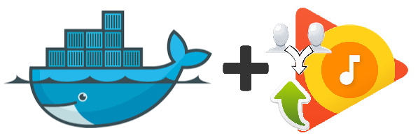

Google MusicManager Deduplication API - Docker Image
====================================================

[](https://hub.docker.com/r/jaymoulin/google-musicmanager-dedup-api/)
[](https://hub.docker.com/r/jaymoulin/google-musicmanager-dedup-api/)
[](https://m.freewallet.org/id/374ad82e/btc)
[](https://m.freewallet.org/id/374ad82e/ltc)
[](https://www.paypal.me/jaymoulin)
[](https://www.buymeacoffee.com/3Yu8ajd7W)

This image allows you utilize deduplication feature for [Google MusicManager](https://github.com/jaymoulin/google-music-manager)

Installation
---

```
docker run -d --restart=always -v /path/to/your/db:/app/db --name googlemusic-dedup jaymoulin/google-musicmanager-dedup-api
```

You can mount a volume to `/app/db/` to keep the database outside the container

Appendixes
---

### Install Docker

If you don't have Docker installed yet, you can do it easily in one line using this command
 
```
curl -sSL "https://gist.githubusercontent.com/jaymoulin/e749a189511cd965f45919f2f99e45f3/raw/0e650b38fde684c4ac534b254099d6d5543375f1/ARM%2520(Raspberry%2520PI)%2520Docker%2520Install" | sudo sh && sudo usermod -aG docker $USER
```
